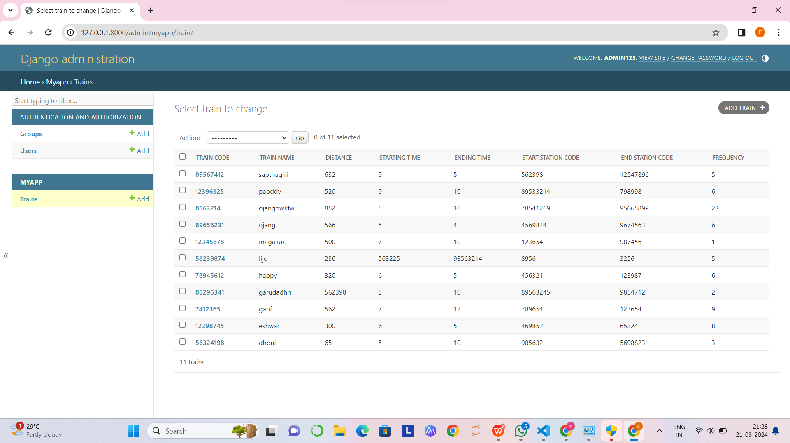

# Ex02 Django ORM Web Application
## Date: 

## AIM
To develop a Django application to store and retrieve data from a Book database using Object Relational Mapping(ORM).

## Entity Relationship Diagram

Include your ER diagram here

## DESIGN STEPS

### STEP 1:
Clone the problem from GitHub

### STEP 2:
Create a new app in Django project

### STEP 3:
Enter the code for admin.py and models.py

### STEP 4:
Execute Django admin and create details for 10 books

## PROGRAM

```py
from django.db import models
from django.contrib import admin
class Train(models.Model):
    train_code=models.IntegerField()
    train_name=models.CharField(max_length=20,primary_key=True)
    distance=models.IntegerField()
    starting_time=models.IntegerField()
    ending_time=models.IntegerField()
    start_station_code=models.IntegerField()
    end_station_code=models.IntegerField()
    frequency=models.IntegerField()
class TrainAdmin(admin.ModelAdmin):
    list_display=('train_code','train_name','distance','starting_time','ending_time','start_station_code','end_station_code','frequency')
```

```py
from django.contrib import admin
from .models import Train,TrainAdmin
admin.site.register(Train,TrainAdmin)
```


## OUTPUT




## RESULT
Thus the program for creating a database using ORM hass been executed successfully
